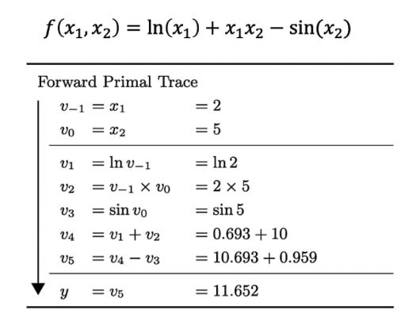
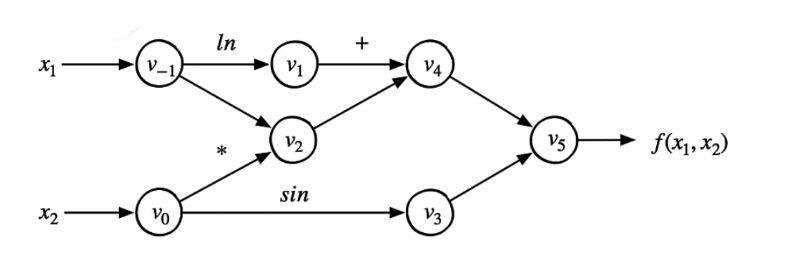
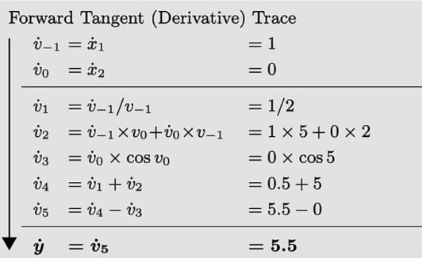
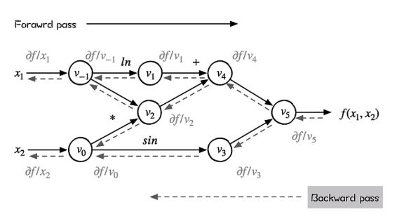
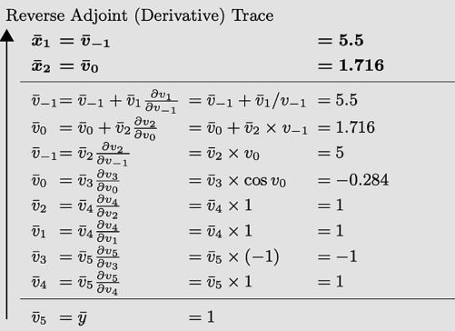

# AI_Learn 2_1 矩阵分析理论

## 1. 矩阵的导数运算

[参考文献](https://zhuanlan.zhihu.com/p/263777564)

### 标量函数$f(\bold{x})$对向量$\bold{x}$的导数

假设$\bold{x}$为列向量$\bold{x} = [x_1 \quad x_2 \quad ... \quad x_m]^T$，则标量函数$f(\bold{x})$对向量的导数为：
$$
\frac{\partial f(\bold{x})}{\partial \bold{x}} = 
\left[\begin{matrix}
\frac{\partial f(\bold{x})}{\partial x_1} \\
\frac{\partial f(\bold{x})}{\partial x_2} \\
... \\
\frac{\partial f(\bold{x})}{\partial x_m}
\end{matrix}\right]_{m \times 1}
$$
结果的行数和分母相同，称之为**分母排布**（梯度向量形式）。

如果$\bold{x}$为行向量$\bold{x} = [x_1 \quad x_2 \quad ... \quad x_m]$，则标量函数$f(\bold{x})$对向量的导数为：
$$
\frac{\partial f(\bold{x})}{\partial \bold{x}} = 
\left[\begin{matrix}
\frac{\partial f(\bold{x})}{\partial x_1} &
\frac{\partial f(\bold{x})}{\partial x_2} &
... &
\frac{\partial f(\bold{x})}{\partial x_m}
\end{matrix}\right]_{1 \times m}
$$
结果的行数和分子相同，称之为**分子排布**。两种布局互为转置。

**例1 $f(y_1,y_2) = y_1^2 + y_2^2$，求$\frac{\partial f(\bold{y})}{\partial \bold{y}} $**

> 取$\bold{y} = [y_1 \quad y_2]^T$，则$\frac{\partial f(\bold{y})}{\partial \bold{y}} $为：
> $$
> \frac{\partial f(\bold{y})}{\partial \bold{y}} = 
> \left[\begin{matrix}
> 2y_1 \\
> 2y_2 \\
> \end{matrix}\right]
> $$

### 标量函数$f(\bold{X})$对矩阵$\bold{X}_{m \times n}$的导数

$vex(\bold{X})$ ，作用是将矩阵$\bold{X}$按列堆栈来向量化。将矩阵的每一列取出再以行向量方式排布。

通常的有两种形式表示$\frac{\partial f(\bold{X})}{\partial \bold{X}}$： Jacobian 矩阵形式和梯度矩阵形式。

**Jacobian 矩阵形式**：先把矩阵$\bold{X}$进行转置，再对转置后的每个位置的元素逐个求偏导；
$$
\frac{\partial f(\bold{X})}{\partial \bold{X}} = 
\left[\begin{matrix}
\frac{\partial f(\bold{X})}{\partial x_{11}} & \frac{\partial f(\bold{X})}{\partial x_{21}} & ... & \frac{\partial f(\bold{X})}{\partial x_{m1}}\\
\frac{\partial f(\bold{X})}{\partial x_{12}} & \frac{\partial f(\bold{X})}{\partial x_{22}} & ... & \frac{\partial f(\bold{X})}{\partial x_{m2}}\\
... & ... & ... & ...\\
\frac{\partial f(\bold{X})}{\partial x_{1n}} & \frac{\partial f(\bold{X})}{\partial x_{2n}} & ... & \frac{\partial f(\bold{X})}{\partial x_{mn}}
\end{matrix}\right]_{n \times m}
$$
**梯度矩阵形式**：对矩阵$\bold{X}$的每个位置的元素逐个求偏导，结果布局和原矩阵布局一样。
$$
\frac{\partial f(\bold{X})}{\partial \bold{X}} = 
\left[\begin{matrix}
\frac{\partial f(\bold{X})}{\partial x_{11}} & \frac{\partial f(\bold{X})}{\partial x_{12}} & ... & \frac{\partial f(\bold{X})}{\partial x_{1n}}\\
\frac{\partial f(\bold{X})}{\partial x_{21}} & \frac{\partial f(\bold{X})}{\partial x_{22}} & ... & \frac{\partial f(\bold{X})}{\partial x_{2n}}\\
... & ... & ... & ...\\
\frac{\partial f(\bold{X})}{\partial x_{m1}} & \frac{\partial f(\bold{X})}{\partial x_{m2}} & ... & \frac{\partial f(\bold{X})}{\partial x_{mn}}
\end{matrix}\right]_{m \times n}
$$

### 向量函数$\bold{f(\bold{x})}$对向量$\bold{x}$的导数

假设$\bold{f(\bold{x})} = [f_1(\bold{x}) \quad f_2(\bold{x}) \quad ... \quad f_n(\bold{x})]^T$，$\bold{x}$为列向量$\bold{x} = [x_1 \quad x_2 \quad ... \quad x_m]^T$，则使用分母排布时，有：
$$
\frac{\bold{\partial f(\bold{x})}}{\partial \bold{x}} = 
\left[\begin{matrix}
\frac{\partial \bold{f(\bold{x})}}{\partial x_1} \\
\frac{\partial \bold{f(\bold{x})}}{\partial x_2} \\
... \\
\frac{\partial \bold{f(\bold{x})}}{\partial x_m}
\end{matrix}\right]_{m \times 1} = 
\left[\begin{matrix}
\frac{\partial f_1(\bold{x})}{\partial x_1} & \frac{\partial f_2(\bold{x})}{\partial x_1} & ... & \frac{\partial f_n(\bold{x})}{\partial x_1}\\
\frac{\partial f_1(\bold{x})}{\partial x_2} & \frac{\partial f_2(\bold{x})}{\partial x_2} & ... & \frac{\partial f_n(\bold{x})}{\partial x_1}\\
... & ... & ... & ...\\
\frac{\partial f_1(\bold{x})}{\partial x_m} & \frac{\partial f_2(\bold{x})}{\partial x_m} & ...& \frac{\partial f_n(\bold{x})}{\partial x_1}
\end{matrix}\right]_{m \times n}
$$
**例2 $\bold{f(\bold{y})} = [y_1^2+y_2^2+y_3 \quad y_3^2+2y_1]$，求$\frac{\partial \bold{f(\bold{y})}}{\partial \bold{y}} $**

> 取$\bold{y} = [y_1 \quad y_2 \quad y_3]^T$，则$\frac{\partial \bold{f(\bold{y})}}{\partial \bold{y}} $为：
> $$
> \frac{\bold{\partial f(\bold{y})}}{\partial \bold{y}} = 
> \left[\begin{matrix}
> \frac{\partial \bold{f(\bold{y})}}{\partial y_1} \\
> \frac{\partial \bold{f(\bold{y})}}{\partial y_2} \\
> \frac{\partial \bold{f(\bold{y})}}{\partial y_3}
> \end{matrix}\right] = 
> \left[\begin{matrix}
> \frac{\partial f_1(\bold{y})}{\partial y_1} & \frac{\partial f_2(\bold{y})}{\partial y_1} \\
> \frac{\partial f_1(\bold{y})}{\partial y_2} & \frac{\partial f_2(\bold{y})}{\partial y_2} \\
> \frac{\partial f_1(\bold{y})}{\partial y_3} & \frac{\partial f_2(\bold{y})}{\partial y_3} 
> \end{matrix}\right] =
> \left[\begin{matrix}
> 2y_1 & 2 \\
> 2y_2 & 0 \\
> 1 & 2y_3
> \end{matrix}\right]
> $$

常用结论（分母布局）：

- $\frac{\partial \bold{Ay}}{\partial \bold{y}} = \bold{A}^T$；
- $\frac{\partial \bold{y^T Ay}}{\partial \bold{y}} = \bold{Ay} + \bold{A^T y}$；

### 矩阵函数$\bold{F}(\bold{X})_{p \times q}$对矩阵$\bold{X}_{m \times n}$的导数

通常的有两种形式表示$\frac{\partial \bold{F}(\bold{X})}{\partial \bold{X}}$： Jacobian 矩阵形式和梯度矩阵形式。

**Jacobian 矩阵形式**：先把矩阵$\bold{X}$进行vec向量化，再对$\bold{F}(\bold{X})$进行vec向量化，随后进行分子排布；

**梯度矩阵形式**：先把矩阵$\bold{X}$进行vec向量化，再对$\bold{F}(\bold{X})$进行vec向量化，随后进行分母排布。

## 2. 自动微分

### 计算机的微分方式

计算器求解微分的方式有三种：符号微分，数值微分和自动微分。

**符号微分**：通过求导法则（加法法则和乘法法则）指定表达式变换规则。将原表达式转换为导数表达式：
$$
\frac{d}{dx}(f(x)+g(x)) = \frac{d}{\partial x}f(x) + \frac{d}{\partial x}g(x) 
$$

$$
\frac{d}{dx}(f(x)g(x)) = (\frac{d}{\partial x}f(x))g(x) + f(x)(\frac{d}{\partial x}g(x))
$$

符号微分可以得到精确的数值结果，缺点是表达式膨胀。

**数值微分**：通过差分进行近似：
$$
\frac{\partial f(x)}{\partial x} = lim_{x \to 0}\frac{f(x+h) - f(x)}{h}
$$
容易实现，缺点是计算结果不精确，计算复杂度高，对$h$要求高。

**自动微分**：所有数值运算由有限的基本运算组成，基本运算的导数表达式已知，通过链式法则将数值计算组合为整体。

### 自动微分的模式

[参考资料](https://www.bilibili.com/video/BV1FV4y1T7zp/?spm_id_from=333.788)

#### 前向微分

**例3 $f(x_1,x_2) = ln(x_1) + x_1x_2 - sin(x_2)$，求$\frac{\partial \bold{f(\bold{x})}}{\partial \bold{x}} $**

> 列出前向的数值计算表：
>
> 
>
> 将原函数的数值计算转化为有向无环图：
>
> 
>
> 将函数微分式按照链式法则展开：
> $$
> \frac{\partial f}{\partial x_1} = \frac{\partial v_{-1}}{\partial x_1}(\frac{\partial v_{1}}{\partial v_{-1}}\frac{\partial v_{4}}{\partial v_1}+\frac{\partial v_{2}}{\partial v_{-1}}\frac{\partial v_{4}}{\partial v_2})\frac{\partial v_{5}}{\partial v_4}\frac{\partial f}{\partial v_5}
> $$
> 按照上式进行反向计算：
>
> 
>
> 即通过有向无环图的求导得到结果。

#### 反向微分

通过反向微分也可以求得函数对于每个变量的微分。

$$
\frac{\partial f}{\partial \bold{x}} = \sum^N_{k=1}\frac{\partial f}{\partial v_k}\frac{\partial v_K}{\partial \bold{x}}
$$

### 矩阵与自动微分

对于多输入多输出的计算图，将其视为向量函数$\bold{f(x)}$，对向量的导数用分子排列表示，即为 Jacobian 矩阵：
$$
\bold{J}_f = \frac{\bold{\partial f(\bold{x})}}{\partial \bold{x}} = 
\left[\begin{matrix}
\frac{\partial \bold{f(\bold{x})}}{\partial x_1} &
\frac{\partial \bold{f(\bold{x})}}{\partial x_2} &
... &
\frac{\partial \bold{f(\bold{x})}}{\partial x_m}
\end{matrix}\right]_{1 \times m} = 
\left[\begin{matrix}
\frac{\partial f_1(\bold{x})}{\partial x_1} & \frac{\partial f_1(\bold{x})}{\partial x_2} & ... & \frac{\partial f_1(\bold{x})}{\partial x_m}\\
\frac{\partial f_2(\bold{x})}{\partial x_1} & \frac{\partial f_2(\bold{x})}{\partial x_2} & ... & \frac{\partial f_2(\bold{x})}{\partial x_m}\\
... & ... & ... & ...\\
\frac{\partial f_n(\bold{x})}{\partial x_1} & \frac{\partial f_n(\bold{x})}{\partial x_2} & ...& \frac{\partial f_n(\bold{x})}{\partial x_m}
\end{matrix}\right]_{n \times m}
$$
假设向量函数可以通过一个函数（通常为损失函数）组合为一个标量函数$l = g(\bold{f(x)})$，通过链式法则可得：
$$
\frac{\partial l}{\partial \bold{y}} = 
\left[\begin{matrix}
\frac{\partial l}{\partial y_1} \\
\frac{\partial l}{\partial y_2} \\
... \\
\frac{\partial l}{\partial y_n}
\end{matrix}\right]_{n \times 1}
$$
则每个输出关于输入$x_1$的导数（梯度）即可通过 Jacobian - Vector 积求出：（前向微分）
$$
\bold{J}_f \cdot \frac{\partial l}{\partial \bold{y}} = 
\left[\begin{matrix}
\frac{\partial y_1}{\partial x_1} \\
\frac{\partial y_2}{\partial x_1} \\
... \\
\frac{\partial y_n}{\partial x_1}
\end{matrix}\right]_{n \times 1}
$$
Vector - Jacobian 积即为输出对于每一个输入的导数：（反向微分）
$$
\bold{J}_f^T \cdot \frac{\partial l}{\partial y} = 
\left[\begin{matrix}
\frac{\partial l}{\partial x_1} \\
\frac{\partial l}{\partial x_2} \\
... \\
\frac{\partial l}{\partial x_m}
\end{matrix}\right]_{m \times 1}
$$
