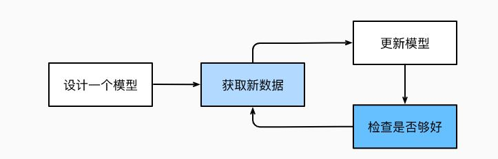
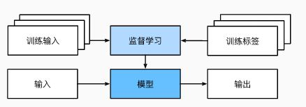
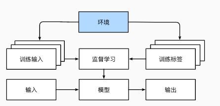
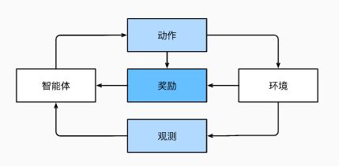

# AI-Learn 2_深度学习导论

## 1. 日常生活和机器学习

1. 以淘宝为例：

> 为了完善业务能力，程序开发者需要考虑到所有可能的情况，并为其设置合适的规则。
>
> 但是，当任务在人类眼中看来很简单，但是在程序上很难或无法穷举时（比如在任意情况下看到框里面有两个任意放置的球），**机器学习可以从经验中学习（比如通过观测数据或者与环境交互），积累更多的经验，提高自身的性能。**

2. 以Siri为例：

>  现在，假如需要编写程序来响应一个“唤醒词”。 我们试着用一台计算机和一个代码编辑器编写代码。 问题看似很难解决：麦克风每秒钟将收集大约44000个样本，每个样本都是声波振幅的测量值。而该测量值与唤醒词难以直接关联。那又该如何编写程序，令其输入麦克风采集到的原始音频片段,输出是否（表示该片段是否包含唤醒词）的可靠预测呢？我们对编写这个程序毫无头绪，这就是需要机器学习的原因。

通常，即使我们不知道怎样明确地告诉计算机如何从输入映射到输出，大脑仍然能够自己执行认知功能。 

### 数据集（Dataset）

首先，我们需要创建一个**数据集（Dataset）**。对有效的部分和无效的部分进行**标记**。

利用机器学习，我们不需要一个十分明确的系统（只需要一个黑箱），其输出只需要一些**参数（Parameter）**决定，然后使用数据集确定当下的**最佳参数集**。这些参数通过某种**性能度量**方式达到完成任务的最佳性能。

### 参数（Parameter）

参数是一个程序的属性，输入 -> 程序 -> 输出；参数的调整会导致程序的变化，变化后的程序称之为**模型（model）**。

通过操作参数生成的不同程序（输入-输出映射）称之为**模型族**。

通过数据集选择参数的元程序称之为**学习算法（learning algorithm）**。

### 输入（Input），输出（Output）和模型族的选择

在开始用机器学习算法解决问题之前，我们必须精确地定义问题，确定**输入（input）**和**输出（output）**的性质，并选择合适的模型族。

对于相同种的任务，使用同一个模型族是合理的；但是对于处理完全不同的输入和输出时，可能需要不同的模型族。

### 学习（Learning）

如果程序参数被随机设置，就不可能对于特定输入进行精准判断。在机器学习中，**学习（Learning）**即为训练模型的过程。通过这个过程，可以发现合适的参数集。

典型的训练过程满足如下的循环：

> 1. 从全新的模型开始（这个模型没有“智能”）；
> 2. 获取一些数据样本（输入和对应的标签）；
> 3. 调整参数，使得模型在样本中表现的更好；
> 4. 重复，直至模型使得我们满意。

## 2. 机器学习的关键组件

### 数据（Data）

每个数据集由一个个**样本（example, sample）**组成，大多时候，它们遵循**独立同分布(independently and identically distributed)**。 

> **独立同分布：**
>
> 随机过程中，任何时刻的取值都为随机变量，如果这些随机变量服从同一种分布，并且互相独立，那么这些随机变量是独立同分布。

样本有时也叫做**数据点（data point）**或者**数据实例（data instance）**，通常每个样本由一组称为**特征（features）**或**协变量（covariates）**的属性组成。 机器学习模型会根据这些属性进行预测。

在监督学习问题中，要预测的是一个特殊的属性，它被称为**标签（label）**，或**目标（target）**。

对于图像数据而言，每一张图像即为一个样本，它的特征是像素的有序列表。当每个样本的特征类别相同时，其特征向量是等长的，此长度称为数据的**维数（dimensionality）**。

***固定长度的特征向量可以用来量化大量的学习样本。***

但是，当数据差别过大（图像的尺寸，语言的长度）时，使用特征向量是不可取的。与传统的机器学习相比，深度学习的一个优势就在于能处理不同尺寸的数据。

***数据集中的数据数量越多，训练出来的模型就更强大，从而减少对预先假设的依赖。***

但是，在海量的数据集中应该有正确的数据，如果无效数据过多，可能会导致模型失效。这就要求数据集中的样本要均衡。

### 模型（Model）

大多数机器学习通过简单的模型实现数据的转换。但是当研究问题的复杂度超出经典方法时，将使用深度学习。

深度学习中的模型由神经网络交织在一起，包含层层数据转换。

### 目标函数（Objective function）

在机器学习中，需要定义模型的优劣程度的度量，这个度量在大多数情况是“可优化”的，这被称之为**目标函数（objective function）**。 定义的目标函数通常被希望优化到最低点（又被称为**损失函数（loss function）**）。

1. 当任务试图预测数值（当前机器人的位置，速度）时，常用的损失函数是**平方误差**。平方误差很容易被优化；
2. 当任务试图解决分类问题（判断是或不是）时，常用的损失函数是**错误率**。错误率由于其不可微性难以直接优化，在这种情况下通常优化替代目标。

**损失函数是由模型参数定义的，并取决于数据集。**在一个数据集上，可以通过最小化损失函数得到模型学习后的最佳值。该数据集称之为训练数据集（training set）；但是在测试数据集（test set）不一定拥有同样的性能。

**训练数据集用于拟合模型参数，测试数据集用于评估模型的拟合程度。**当一个模型在训练集上表现良好，但在测试集上表现不佳时，模型是**过拟合（overfitting）**的。

### 优化算法

**优化算法用于寻找使得损失函数取得最小值的程序参数。**通常的优化算法是**梯度下降**算法。

在每个步骤中，梯度下降法都会检查每个参数，看看如果仅对该参数进行少量变动，训练集损失会朝哪个方向移动。 然后，它在可以减少损失的方向上优化参数。

## 3. 机器学习的分类

### 监督学习（supervised learning）

**监督学习擅长在给定输入特征的情况下预测标签。**每个特征-标签对称为一个样本。目标是生成一个模型，能够将任何输入特征映射到标签（即预测）。

监督学习通过估计给定输入特征的标签的条件概率，从而预测给定输入特征包含此种标签的概率。（通过现在已经发生的时间预测接下来发生的概率）。

监督学习流程如下：

> 1. 从已知大量数据样本中随机选取一个子集，为每个样本获取真实标签。有时，这些样本已有标签；有时，这些样本可能需要被人工标记（图像分类）。这些输入和相应的标签一起构成了训练数据集；
> 2. 选择有监督的学习算法，它将训练数据集作为输入，并输出一个“已完成学习的模型“；
> 3. 将之前没有见过的样本特征放到这个“已完成学习的模型“中，使用模型的输出作为相应标签的预测。

即使使用简单的描述给定输入特征的预测标签，监督学习也可以采取多种形式的模型，并且需要大量不同的建模决策，这取决于输入和输出的类型、大小和数量。 例如，我们使用不同的模型来处理“任意长度的序列”或“固定长度的序列”。

#### 回归（regression）

对于一些有特定特征的问题，如果需要预测一个数值，此问题为回归问题。回归问题的损失常为平方误差。

> 比如通过房屋面积，卧室数量，浴室数量，步行距离预测房价；通过用户言论预测电影评分。总而言之，回归问题是关于“有多少”的问题。

#### 分类（classification）

分类是训练一个分类器来输出预测的类别。（与回归不同，回归是训练一个回归函数来输出一个数值）；

分类本质上是预测概率的大小。分类常见的损失是**交叉熵损失。**

注意，最常见的类别不一定用于最终决策，有些时候，需要将求得的概率进行加权从而求得预期风险（毒蘑菇）。

> 分类可能变得比二项分类、多项分类复杂得多。
>
> 有一些分类任务的变体可以用于寻找层次结构，层次结构假定在许多类之间存在某种关系。 因此，并不是所有的错误都是均等的。
>
> 宁愿错误地分入一个相关的类别，也不愿错误地分入一个遥远的类别，这通常被称为*层次分类*(hierarchical classification)。层次结构相关性可能取决于模型的使用者计划如何使用模型。

#### 标记问题

学习预测不相互排斥的类别的问题称为*多标签分类*（multi-label classification）。（比如判断图像中有些什么）

#### 搜索问题

有时，我们不仅仅希望输出一个类别或一个实值。 在信息检索领域，我们希望对一组项目进行排序。 搜索结果的排序也十分重要，学习算法需要输出有序的元素子集。

首先为集合中的每个元素分配相应的相关性分数，然后检索评级最高的元素。

#### 推荐系统

#### 序列问题

如果输入是连续的，模型可能需要记忆功能（比如说连续的视频片段）。通过前一段来使得后一段的序列更有把握。

序列学习需要摄取输入序列或预测输出序列，或两者兼而有之。 具体来说，输入和输出都是可变长度的序列。

### 无监督学习

数据中不含有“目标”的机器学习问题通常被为**无监督学习（unsupervised learning）**。

> - *聚类*（clustering）问题：没有标签的情况下，我们是否能给数据分类呢？比如，给定一组照片，我们能把它们分成风景照片、狗、婴儿、猫和山峰的照片吗？同样，给定一组用户的网页浏览记录，我们能否将具有相似行为的用户聚类呢？
> - *主成分分析*（principal component analysis）问题：我们能否找到少量的参数来准确地捕捉数据的线性相关属性？比如，一个球的运动轨迹可以用球的速度、直径和质量来描述。再比如，裁缝们已经开发出了一小部分参数，这些参数相当准确地描述了人体的形状，以适应衣服的需要。另一个例子：在欧几里得空间中是否存在一种（任意结构的）对象的表示，使其符号属性能够很好地匹配?这可以用来描述实体及其关系，例如“罗马” − “意大利” + “法国” = “巴黎”。
> - *因果关系*（causality）和*概率图模型*（probabilistic graphical models）问题：我们能否描述观察到的许多数据的根本原因？例如，如果我们有关于房价、污染、犯罪、地理位置、教育和工资的人口统计数据，我们能否简单地根据经验数据发现它们之间的关系？
> - *生成对抗性网络*（generative adversarial networks）：为我们提供一种合成数据的方法，甚至像图像和音频这样复杂的非结构化数据。潜在的统计机制是检查真实和虚假数据是否相同的测试，它是无监督学习的另一个重要而令人兴奋的领域。

## 4. 深度学习和强化学习

### 环境

对于以上的监督学习而言，都会预先获取大量数据，启动模型后不再与环境交互，此时所有学习在算法和环境断开的条件下运行，称之为**离线学习（offline learning）**。

当期望模型能够通过环境改变自身参数以适应任务时，需要从环境中为监督学习获取数据。与预测不同，“与真实环境互动”实际上会影响环境。 对于现实而言，需要考虑的是环境是否变化。此时将产生**分布偏移**问题。

### 强化学习

针对于环境交互，**强化学习（einforcement learning）**得到了比较广泛的运用。

在强化学习问题中，智能体（agent）在一系列的时间步骤上与环境交互。 在每个特定时间点，智能体从环境接收一些**观察（observation）**，并且必须选择一个**动作（action）**，然后通过某种机制（有时称为执行器）将其传输回环境，最后智能体从环境中获得**奖励（reward）**。 此后新一轮循环开始，智能体接收后续观察，并选择后续操作，依此类推。

强化学习的目标是产生一个好的**策略（policy）**。 强化学习智能体选择的“动作”受策略控制，即一个从环境观察映射到行动的功能。

可以将任何监督学习问题转化为强化学习问题。此时可以**用奖励替换原来的损失函数**。

强化学习还可以解决许多监督学习无法解决的问题。 例如，在监督学习中，我们总是希望输入与正确的标签相关联。 但在强化学习中，我们并不假设环境告诉智能体每个观测的最优动作。 一般来说，智能体只是得到一些奖励。 此外，环境甚至可能不会告诉是哪些行为导致了奖励。

强化学习可能还必须处理部分可观测性问题。 也就是说，当前的观察结果可能无法阐述有关当前状态的所有信息。 比方说，一个清洁机器人发现自己被困在一个许多相同的壁橱的房子里。 推断机器人的精确位置（从而推断其状态），需要在进入壁橱之前考虑它之前的观察结果。

最后，在任何时间点上，强化学习智能体可能知道一个好的策略，但可能有许多更好的策略从未尝试过的。 强化学习智能体必须不断地做出选择：是应该利用当前最好的策略，还是探索新的策略空间（放弃一些短期回报来换取知识）。

当环境可被完全观察到时，强化学习问题被称为**马尔可夫决策过程（markov decision process）**。 当状态不依赖于之前的操作时，我们称该问题为**上下文赌博机（contextual bandit problem）**。 当没有状态，只有一组最初未知回报的可用动作时，这个问题就是经典的**多臂赌博机（multi-armed bandit problem）**。
