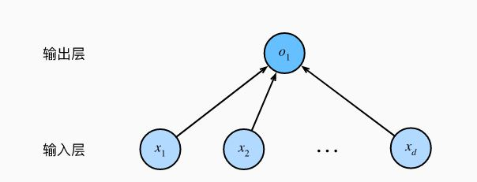

# AL_Learn 4_线性神经网络

## 1. 线性回归

**回归（regression）**是能为一个或多个自变量与因变量之间关系建模的一类方法。

### 线性回归的基本要素

1. 基本假设：

> - 自变量$x$和因变量$y$之间的关系是线性的。（$y$可以表示为$x$的加权和）（允许少量的噪声存在）
> - 假设任何噪声都比较正常，如噪声遵循正态分布。

2. 线性回归的基本要素

**训练数据集（training set）：**用于进行模型训练；

**样本（sample）**：训练数据集的每行数据；

**标签（label）**：试图预测的目标；

**特征（feature）**：预测依据的自变量。

3. 通常的，使用$n$表示数据集中的样本数，对于索引为$i$的样本，输入为$x^{(i)} = [x_1^{(i)},x_2^{(i)}]$，输出为$y^{(i)}$。

### 线性回归的基本模型

**线性假设指目标和特征的加权和。**
$$
\hat{y} = w_1x_1 + w_2x_2 + \ldots + w_mx_m + b
$$
式中$w_j$为**权重（weight）**，权重决定了每个特征对预测值的影响。$b$为**偏置（bias）**，指当所有特征都取值为0时，预测值应该为多少。

上式也被称之为输入特征的**仿射变换**，仿射变换的特点是通过加权和对特征进行**线性变换（linear transformation）**， 并通过偏置项来进行**平移（translation）**。

给定一个数据集，目标为寻找合适的权重和偏置，使得模型的预测尽可能准确。输出的预测值由输入特征通过线性模型的仿射变换决定，仿射变换由所选权重和偏置确定。

当输入包含$m$个特征时，令特征向量$\bold{x} \in \mathbb{R}^m $，权重向量$\bold{w} \in \mathbb{R}^b$，则
$$
\hat{y} = \bold{w}^T\bold{x} + b
$$
使用矩阵$\bold{X} \in \mathbb{R}^{n \times m}$可以表示每个样本。$\bold{X}$的每一行为一个样本，每一列为一个特征。则预测值：
$$
\bold{\hat{y}} = \bold{Xw}+b
$$
则目标为，给定训练数据特征$\bold{X}$和对应已知标签$\bold{y}$，找到一组权重向量$\bold{w}$和偏置$b$，使得预测误差尽可能小。

即使确信特征与标签的潜在关系是线性的， 也应加入一个噪声项来考虑观测误差带来的影响。

### 线性回归的损失函数

*损失函数*（loss function）能够量化目标的实际值与预测值之间的差距。 通常选择非负数作为损失，且数值越小表示损失越小，完美预测时的损失为0。 

回归问题中最常用的损失函数是平方误差函数。 当样本$i$的预测值为$\hat{y}^{(i)}$，其相应的真实标签为$y^{(i)}$时， 平方误差可以定义为以下公式：
$$
l^{(i)}(\bold{w},b)=\frac{1}{2}(\hat{y}^{(i)}-y^{(i)})^2
$$
 由于训练数据集并不受控制，所以**经验误差只是关于模型参数的函数**。

对于$n$个样本而言，使用均值衡量总体的损失。
$$
L(\bold{w},b) = \frac{1}{n}\sum^n_{i=1}l^{(i)}(\bold{w},b)=\frac{1}{n}\sum^n_{i=1}\frac{1}{2}(\bold{w}^T\bold{x}^{(i)}+b-y^{(i)})^2
$$
训练模型时，我们希望寻找一组参数$(\bold{w}^{*},b^*)$使得：
$$
\bold{w}^{*},b^* = argmin \quad L(\bold{w},b)
$$
线性回归的解可以用一个公式简单地表达出来， 这类解叫作解析解。

> 首先，将偏置$b$合并到参数$\bold{w}$中，合并方法是在包含所有参数的矩阵中附加一列。
>
> 目标是将$||\bold{y - Xw}||^2$取得最小值，这在损失平面上只有一点，对应于整个区域的损失极小点，使$\frac{\partial ||\bold{y - Xw}||^2}{\partial \bold{w}} = 0$得到解析解：
> $$
> \bold{w}^{*} = \bold{(X^T X)^{-1}X^T y}
> $$

### 随机梯度下降算法

梯度下降最简单的用法是**计算损失函数（数据集中所有样本的损失均值） 关于模型参数的导数（在这里也可以称为梯度）。**

为了提高计算速率，通常会在每次需要计算更新的时候随机抽取一小批样本， 这种变体叫做**小批量随机梯度下降（minibatch stochastic gradient descent）**。

在每次迭代中，首先随机抽样一个小批量B， 它是由固定数量的训练样本组成的。 然后，我们计算小批量的平均损失关于模型参数的导数（也可以称为梯度）。 最后，将梯度乘以一个预先确定的正数$\eta$，并从当前参数的值中减掉。
$$
(\bold{w},b) \gets (\bold{w},b)-\frac{\eta}{|B|}\sum_{i \in B}\partial_{(\bold{W},b)}l^{(i)}(\bold{w},b)
$$

> （1）初始化模型参数的值，如随机初始化； 
>
> （2）从数据集中随机抽取小批量样本且在负梯度的方向上更新参数，并不断迭代这一步骤。

 $|B|$表示每个小批量中的样本数，也称为**批量大小（batch size）**。 $\eta$表示**学习率（learning rate）**。 批量大小和学习率的值通常是手动预先指定，而不是通过模型训练得到的。 这些**可以调整但不在训练过程中更新的参数**称为**超参数（hyperparameter）**。 

调参（hyperparameter tuning）是选择超参数的过程。 超参数通常是根据训练迭代结果来调整的， 而训练迭代结果是在独立的**验证数据集（validation dataset）**上评估得到的。

在训练了预先确定的若干迭代次数后（或者直到满足某些其他停止条件后）， 记录下模型参数的估计值，表示为$(\hat{\bold{w}},\hat{b})$。 但是，即使函数确实是线性的且无噪声，这些估计值也不会使损失函数真正地达到最小值。 因为算法会使得损失向最小值缓慢收敛，但却不能在有限的步数内非常精确地达到最小值。

线性回归恰好是一个在整个域中只有一个最小值的学习问题。 但是对像深度神经网络这样复杂的模型来说，损失平面上通常包含多个最小值。 

通常很少会去花费大力气寻找这样一组参数，使得在训练集上的损失达到最小。 事实上，更难做到的是找到一组参数，这组参数能够在从未见过的数据上实现较低的损失， 这一挑战被称为**泛化（generalization）**。

### 正态分布的观测噪声

正态分布概率密度函数：
$$
p(x) = \frac{1}{\sqrt{2\pi\sigma^2}}exp(-\frac{1}{2\sigma^2}(x-\mu)^2)
$$
含有噪声的线性回归函数如下：
$$
y = \bold{w}^T\bold{x} + b + \epsilon
$$
因此，可以给出特定特征时得到预测值的概率（又称似然）：
$$
P(y|\bold{x}) = \frac{1}{\sqrt{2\pi\sigma^2}}exp(-\frac{1}{2\sigma^2}(y -( \bold{w}^T\bold{x}+b)^2)
$$
为了得到最优的$(\bold{w},b)$，此时需要使用**最大似然估计法**，此时$P(\bold{y|X})$最大。

由于概率运算为乘法运算，使用负对数变为加法运算，即**最小化负对数**。
$$
-logP(\bold{y|X}) = \sum_{i=1}^n\frac{1}{2}log(2\pi\sigma^2)+\frac{1}{2\sigma^2}(y^{(i)} - (\bold{w}^T\bold{x}^{(i)}+b))^2
$$

### 线性神经网络

将线性回归模型描述为一个神经网络。 神经网络只显示连接模式（即每个输入如何连接到输出，省略权重和偏置）。




在上图的神经网络中，输入维数（特征个数）为$d$，即**输入数（特征维度）**为$d$。输出只有一个，则**输出数**为1。

计算层数的时候不会考虑输入层，即**线性神经网络的层数为1。**

对于线性回归，每个输入和每个输出都是相连的，这种变换为**全连接层（fully-connected layer）**或**稠密层（dense layer）**。

## 2. 线性回归神经网络的实现

### 生成数据集

```python
def synthetic_data(w, b, num_examples):
    """生成数据集，满足正态分布
    Args:
        w : 权重向量
        b : 偏置
        num_examples : 样本的个数
    Returns:
        元组,第一个元素为特征张量,第二个元素为标签张量
    """
    X = torch.normal(0, 1, (num_examples, len(w)))
    # y = Wx + b
    y = torch.matmul(X,w)+b
    # 加入高斯噪声项
    y += torch.normal(0, 0.01, y.shape)
    return X, y.reshape((-1, 1))


# 生成模拟数据,自然生成列向量
tr_w = torch.tensor([2, -3.4])
tr_b = 4.2
# 生成特征和标签值
features, labels = synthetic_data(tr_w, tr_b, 1000)
# 生成散点图
d2l.set_figsize()
d2l.plt.scatter(features[:, (1)].detach().numpy(), labels.detach().numpy(), 1)
d2l.plt.show()
```

### 读取数据集

```python
def data_iter(batch_size, features, labels):
    """随机小批量读取数据集

    Args:
        batch_size: 样本批量大小
        features: 数据集特征矩阵
        labels: 标签向量
    Yields:
        随机样本特征子矩阵和标签子矩阵(生成器)
    """
    # batch:批
    num_examples = len(features)
    # 生成0 - num_examples 数据的索引列表
    indices = list(range(num_examples))     # indices:指标
    # 随机打乱列表（洗牌函数）
    random.shuffle(indices)                 # shuffle:洗牌
    # 将打乱后的数组分割，每段为batch_size，输出时使用生成器进行伪随机输出
    # 每次调用生成器时，batch_indices中的值会进行更新
    for i in range(0, num_examples, batch_size):
        batch_indices = torch.tensor(
            indices[i:min(num_examples, i+batch_size)])
        yield features[batch_indices], labels[batch_indices]
```

### 初始化模型参数

```python
# 初始化模型参数,requires_grad表示表示需要计算梯度
w = torch.normal(0, 0.01, size=(2, 1), requires_grad=True)
b = torch.zeros(1, requires_grad=True)
```

### 定义神经网络（模型）

```python
def linreg(X, w, b):
    """线性回归模型函数

    Args:
        X : 小批量样本特征矩阵 
        w : 权重向量 
        b : 偏置 
    Returns:
        求得的预测标签
    """
    return torch.matmul(X, w)+b
```

### 定义损失函数

```python
def squared_loss(y, y_hat):
    """平方损失函数

    Args:
        y : 实际标签向量
        y_hat : 预测标签向量
    Returns:
        平方损失
    """
    return (y_hat - y.reshape(y_hat.shape)) ** 2 / 2
```

### 定义随机梯度下降函数

```python
def sgd(params, lr, batch_size):
    """随机梯度下降函数

    Args:
        params : 神经网络参数
        lr : 学习率
        batch_size : 批量大小
    """
    # 禁用梯度计算
    with torch.no_grad():
        for param in params:
            # 进行梯度下降计算
            param -= lr * param.grad / batch_size
            # 清除梯度值
            param.grad.zero_()
```

### 进行训练

```python
# 训练
for epoch in range(num_epochs):
    for X, y in data_iter(batch_size, features, labels):   # 取小批量的样本
        l = loss(y, net(X, w, b))                          # 模型输出并计算损失函数
        l.sum().backward()                                 # 反向传播求得w,b的梯度值
        sgd([w, b], lr, batch_size)                        # 随机梯度下降
        with torch.no_grad():
            train_l = loss(net(features, w, b), labels)                     # 将求出的参数代入原模型，计算损失函数
            print(f'epoch {epoch + 1}, loss {float(train_l.mean()):f}')
```

## 3. 线性回归神经网络的简单实现

### 创建数据集

```python
# 创建数据集
features, labels = d2l.synthetic_data(true_w, true_b, 1000)
```

### 读取数据集

```python
"""
	创建一个包含输入特征和标签的数据集对象
"""
data.TensorDataset()

"""
	样本数据抽样函数
	第一个参数：数据集
	第二个参数：抽样数量
	第三个参数：是否在每次调用时打乱数据集
"""
data.DataLoader()
```

```python
def load_data(data_arrays, batch_size, is_Trained=True):
    """小批量读取数据集函数

    Args:
        data_arrays : 样本数据
        batch_size : 样本批量大小
        is_Trained : 是否在迭代周期内打乱数据

    Returns:
        _type_: _description_
    """
    # 构建数据集
    dataset = data.TensorDataset(*data_arrays)
    # 返回小批量样本的特征和标签
    return data.DataLoader(dataset, batch_size, shuffle=is_Trained)
```

### 构建神经网络并初始化模型参数

```python
"""
	神经网络类
	构建时在参数中添加所需要素
"""
nn.Sequential()
```

```python
"""
	全连接层类
	第一个参数：输入特征形状
	第二个参数：输出标签形状
"""
nn.Linear()
```

神经网络只有单层，此时使用索引方式选定第一层并使用`weight.data`和`bias.data`进行初始化。

```python
net[0].weight.data.normal_(0, 0.01)
net[0].bias.data.fill_(0)
```

### 定义损失函数

```python
"""
	L2 范数损失函数类
"""
nn.MSEloss()
```

### 定义优化算法

小批量随机梯度下降算法是一种优化神经网络的标准工具， PyTorch在`optim`模块中实现了该算法的许多变种。 

实例化SGD实例时，需要指定网络参数（`net.parameters()`方法）和超参数。

```python
trainer = torch.optim.SGD(net.parameters(), lr=0.03)
```

### 进行训练

在每个迭代周期里，将完整遍历一次数据集（`train_data`）， 不停地从中获取一个小批量的输入和相应的标签。 对于每一个小批量，会进行以下步骤:

- 通过调用`net(X)`生成预测并计算损失`l`（前向传播）。
- 通过进行反向传播来计算梯度。
- 通过调用优化器来更新模型参数。

```python
num_epochs = 3
for epoch in range(num_epochs):
    for X, y in data_iter:
        # 预测并计算损失（前向传播）
        l = loss(net(X), y)
        # 梯度清零
        trainer.zero_grad()
        # 反向传播
        l.backward()
        # 调用优化器
        trainer.step()
    l = loss(net(features), labels)
    print(f'epoch {epoch + 1}, loss {l:f}')
```

## 4. Softmax 回归

### 分类问题

- 分类的表示

通常，对于分类问题，使用概率描述（如该图像有可能属于A类，概率为0.01，有可能属于B类，概率为0.99）。注意，使用概率时应进行**标准化**（以满足概率论公理）。

- 标签的表示

通常使用`one-hot`编码表示标签。（如A，B，C三类，分别为{1,0,0}，{0,1,0}，{0,0,1})。

此时的标签形成一个n维向量，n即为分类的类别。

### 分类线性神经网络架构

以图像分类问题为例：假设输入了含m个像素的图像（输入维数为m），需要进行n个分类（输出维数为n）。则需要n个仿射函数：
$$
o_1 = x_1w_{11}+x_2w_{12}+\dots+x_mw_{1m} + b_1 \\
o_2 = x_1w_{21}+x_2w_{22}+\dots+x_mw_{2m} + b_2 \\
\dots \\
o_n = x_1w_{n1}+x_2w_{n2}+\dots+x_mw_{nm} + b_n \\
$$


对于上述问题构建的神经网络仍然只有一个输出层，为单层神经网络。输出层的每一个输出均由所有输入决定，为全连接层。

将网络函数矩阵化可得：
$$
\bold{o} = \bold{Wx}+\bold{b}
$$

### softmax 运算

为了得到最后的分类结果，在输出向量中找到最大值（大于设定阈值）分量，即可将此分量置信为对应分类。首先需要一个训练的目标函数，激励模型精准的估计概率（在分类器输出0.5的所有样本中，我们希望这些样本是刚好有一半实际上属于预测的类别。 这个属性叫做**校准（calibration）**）

但是此时要求对$\bold{o}$进行标准化，即$\sum_{i=1}^no_i = 1$。此时使用softmax函数：
$$
\bold{\hat{y}} = softmax(\bold{o}) \\
\hat{y_j} = \frac{e^{o_j}}{\sum_{i=1}^{k}e^{o_i}}
$$
softmax函数不改变$o_i$的排列大小顺序，所以经softmax变换后作为输出层的网络仍然是线性神经网络。

### softmax 回归的损失函数

- 对数似然

$\bold{y}$的含义是对任意输入$\bold{x}$每个分类的条件概率。假设数据集$\{\bold{X},\bold{Y}\}$有n个样本，索引$i$的样本由特征向量$\bold{x^{(i)}}$和one-hot标签向量$\bold{y^{(i)}}$构成。同线性回归，此时最小化负对数似然：
$$
-\log P(\mathbf{Y} \mid \mathbf{X}) = \sum_{i=1}^n -\log P(\mathbf{y}^{(i)} \mid \mathbf{x}^{(i)}) = \sum_{i=1}^n l(\mathbf{y}^{(i)}, \hat{\mathbf{y}}^{(i)})
$$
其中，对于任何标签$\mathbf{y}$和模型预测$\hat{\mathbf{y}}$，损失函数为：
$$
l(\mathbf{y}, \hat{\mathbf{y}}) = - \sum_{j=1}^q y_j \log \hat{y}_j
$$
损失函数 通常被称为**交叉熵损失（cross-entropy loss）**。 由于$\mathbf{y}$是一个长度为q的one-hot编码向量， 所以除了一个项以外的所有项j都消失了。 由于所有$\hat{y}_j$都是预测的概率，所以它们的对数永远不会大于0。 因此，如果正确地预测实际标签，即如果实际标签$P(\mathbf{y} \mid \mathbf{x})=1$， 则损失函数不能进一步最小化。 注意，这往往是不可能的。 例如，数据集中可能存在标签噪声（比如某些样本可能被误标）， 或输入特征没有足够的信息来完美地对每一个样本分类。

- softmax 的导数

$$
\begin{split}\begin{aligned} l(\mathbf{y}, \hat{\mathbf{y}}) &= - \sum_{j=1}^q y_j \log \frac{\exp(o_j)}{\sum_{k=1}^q \exp(o_k)} \\ &= \sum_{j=1}^q y_j \log \sum_{k=1}^q \exp(o_k) - \sum_{j=1}^q y_j o_j\\ &= \log \sum_{k=1}^q \exp(o_k) - \sum_{j=1}^q y_j o_j. \end{aligned}\end{split}\
$$

则导数为：
$$
\partial_{o_j} l(\mathbf{y}, \hat{\mathbf{y}}) = \frac{\exp(o_j)}{\sum_{k=1}^q \exp(o_k)} - y_j = \mathrm{softmax}(\mathbf{o})_j - y_j
$$
即：导数是softmax模型分配的概率与实际发生的情况（由one-hot标签向量表示）之间的差异。

## 5. Softmax 回归的实现

